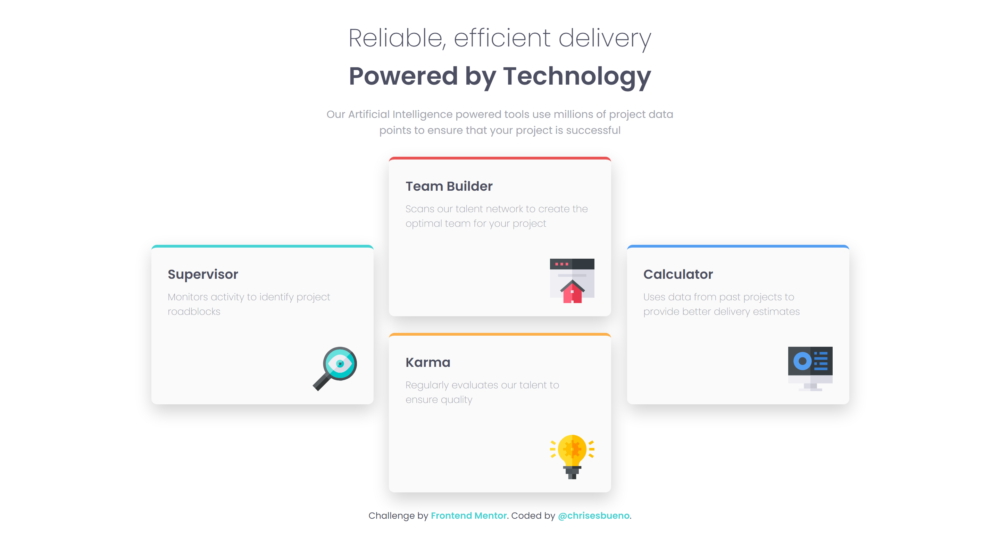
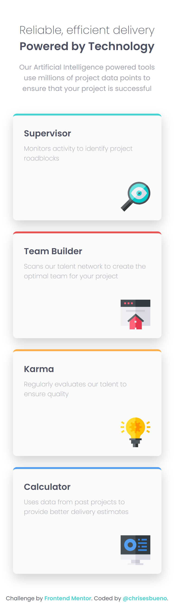

# Frontend Mentor - Four card feature section solution

This is a solution to the [Four card feature section challenge on Frontend Mentor](https://www.frontendmentor.io/challenges/four-card-feature-section-weK1eFYK). Frontend Mentor challenges help you improve your coding skills by building realistic projects. 

## Table of contents

- [Overview](#overview)
  - [The challenge](#the-challenge)
  - [Screenshot](#screenshot)
  - [Links](#links)
- [My process](#my-process)
  - [Built with](#built-with)
  - [What I learned](#what-i-learned)
- [Author](#author)

## Overview

### The challenge

Users should be able to:

- View the optimal layout for the site depending on their device's screen size

### Screenshot





### Links

- Solution URL: [Add solution URL here](https://www.frontendmentor.io/solutions/four-card-feature-section-LVbaukJXic)
- Live Site URL: [Add live site URL here](https://chrisesbueno.github.io/four-card/)

## My process

### Built with

- Semantic HTML5 markup
- CSS custom properties
- Flexbox
- CSS Grid
- Mobile-first workflow

### What I learned

```css
@media screen and (min-width:768px) {
    .container {
        width: 1050px;
        margin: 0px;
    }
    .card__container {
        display: flex;
        align-items: center;
    }
    .up__container h2 {
        font-size: 36px;
    }
    .title__text {
        margin: 1rem auto 0rem;
        width: 55%;
        font-size: 15px;
        color: var(--grayish-blue);
    }
}
```

## Author

- Frontend Mentor - [@chrisesbueno](https://www.frontendmentor.io/profile/chrisesbueno)
- Twitter - [@chrisesbueno](https://www.twitter.com/chrisesbueno)

